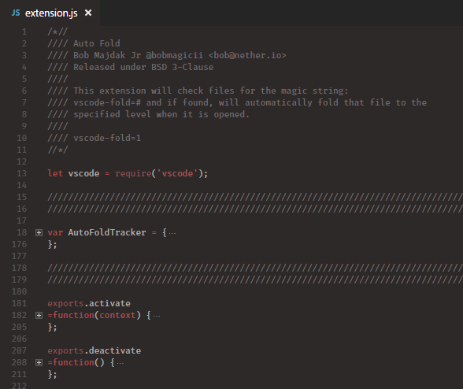
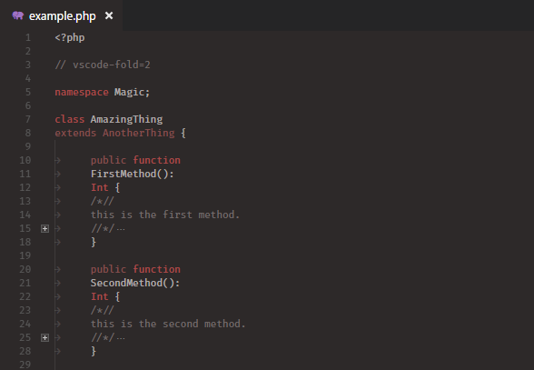

# [](https://marketplace.visualstudio.com/items?itemName=bobmagicii.autofoldyeah) [](https://twitter.com/bobmagicii)

This extension will automatically fold code files when you open them.

Questions? Comments? Suggestions? Email bob at nether dot io or hit me up on Twitter, @bobmagicii.

The following formula is followed to determine if a file should be folded:

## 1) Magic Comment

Does this file contain a magic comment? It does not matter how you put it in the file, all that matters is that it is there and not causing a syntax error. So, single or multiline comments somewhere out of the way. If this magic comment is found then the code is automatically folded to the level it asked.

This method is handy if you deal with a few one off files. Here is an example in a C type language.

`// vscode-fold=<<folding level number>>`

## 2) File Extension Match

Does this file have an extension that matches that in the `autofold.types` data array? If so then the file will be folded to the level configured. There are no default values for this as every developer and project is a unique snowflake.  See the configuration section for more info on how to properly set that up.

This method works well when you have to deal with lots of differnet types of files, are having to work on a large project that already exists, are having to work with a team, just think the magic comment is stupid, or any combo of these.

So for example, in our projects 90% of PHP files are classes, so I autofold all `.php` files to level 2 so i see the class and method signatures. The few files that are not classes I put the magic comment in with a value that makes more sense to them. All CSS files though are pretty flat, `.css` files automatically getting folded to level 1 baring only their definition names by default.

## 3) Default Fallback

Failing the above conditions, you can force all files to be folded at a specific value set with `autofold.default`. See the configuration section for more info about that setting.

# Installation

Use the extension panel in Visual Studio Code, type Fold, find this, install it.

# Configuration

These are the configuration options. Each option will show an example of how it should look in your config. The examples also use the default values.

## `autofold.default`

You can fold all files without magic comments or specific settings in `autofold.types` by default by setting this in either your user or workspace configuration. Default value is 0, which disables auto folding of files that do not ask for it.

```json
"autofold.default": 0
```

## `autofold.delay`

Sometimes code will lie about a file being ready when opened. When a file is opened we put the auto folding on a short delay (250ms) to give it time to get itself together. If your computer is slow, you may need to bump this value up.

```json
"autofold.delay": 250
```

## `autofold.pack`

Fold all sub levels of the level that we really wanted. So for example if the file asked to be folded at level 2, it will fold level 2 and then 3+ so when you expand level 2, you continue to be presented with a minimalist view until you expand more branches.

```json
"autofold.pack": true
```

## `autofold.types`

This defines DEFAULT folding levels based on the file extension of the file. We only check this if the file did not specifically ask with a magic comment. This option takes an array of objects which contain two properties. The property "ext" should be a string which defines the file extension you want to match. I suggest including the dot. It should handle files with multiple dots fine too. The property "level" should be an integer describing which level you want to fold to.

They match top down taking the first one that says yes, notice how the two PHP one, `.php` and `.conf.php` are stacked to get the desired behaviour of falling back.

```json
"autofold.types": [
	{ "ext": ".js", "level": 1 },
	{ "ext": ".c", "level": 1 },
	{ "ext": ".cs", "level": 2 },
	{ "ext": ".conf.php", "level": 1 },
	{ "ext": ".php", "level": 2 }
]
```

## `autofold.unfold`

Automatically unfold files before folding them, default enabled. This will help keep behaviour consistent with various folding levels. If you have a file that was remembered as having a hodgepodge of folded levels, this will unfold everything before folding to the level that file asked for. Recommended you leave it enabled.

```json
"autofold.unfold": true
```

# Keybindings

## `extension.autofold`

You can change this keybinding in your keybindings config. The default is alt+grave (the `, same key as ~) and it will re-fold the file to the level that the file asks to be folded at.

# Tips

If you just added the magic comment to a file and want to fold it without reloading it, or if at any time you want to re-fold a file as configured, you can use the keyboard shortcut `alt+grave` or use the command pallete `ctrl+shift+p` and typing `autofold`.

# Magic Comment Example: Javascript



# Magic Comment Example: PHP



# Known Issues

Just like if you use the normal hot keys without this extension, the block where the cursor is will not be folded, even though everything else will. Considering adding an option to move the cursor out.

# Changelogue

**1.0.6 (2017-03-13)**

- fixes a glitch introduced somewhere around insiders 1.11.0 where files would get re-folded every time you switch tabs. this was partially caused by code being fucking stupid and emitting file open/close events *every tab switch* as well as
they are adding ".git" to the end of all filenames internally for some (what im sure is stupid) reason.

**1.0.5 (2017-01-18)**

- sometimes code tells the extension a file is finished opening, but its a lie. puts the auto-fold-on-file-open on a short delay to give code some time to gets its crap together.

- delay is configurable via `autofold.delay`

**1.0.4 (2017-01-16)**

- add option `autofold.pack` to fold sublevels too. (default true)

**1.0.3 (2017-01-13)**

- clean up debugging and optimise mostly. maybe be slightly snappier, though it already was decent.

**1.0.2 (2017-01-12)**

- added option `autofold.types` to define defaults based on file extension. (no defaults)

- added option `autofold.unfold` to unfold files fully before folding at the requested level. (default true)

**1.0.1 (2017-01-11)**

- added autofold.default to configuration. it will autofold files that do not have vscode-fold in them to the value specified. (default 0 - disabled)

- added keybinding alt+grave to refold file according to its config.

- added statusbar message when auto folding that vanishes after 2sec.

- swap out editor error banners with silent ones because in reality nobody cares if you try and fold when you have no files open, i am sure.

**1.0.0 (2017-01-10)**

- Initial release.
